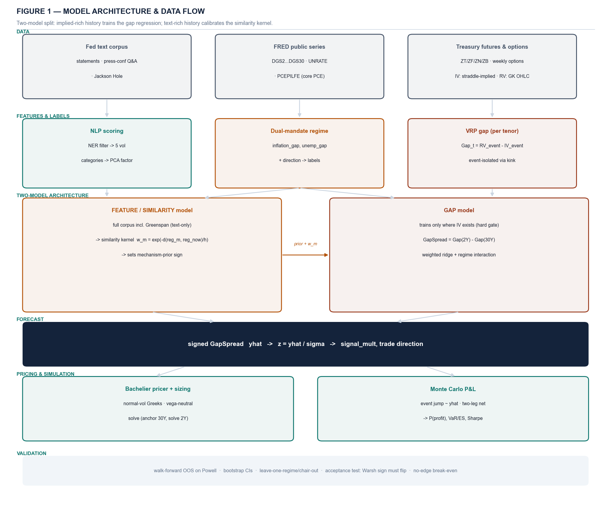
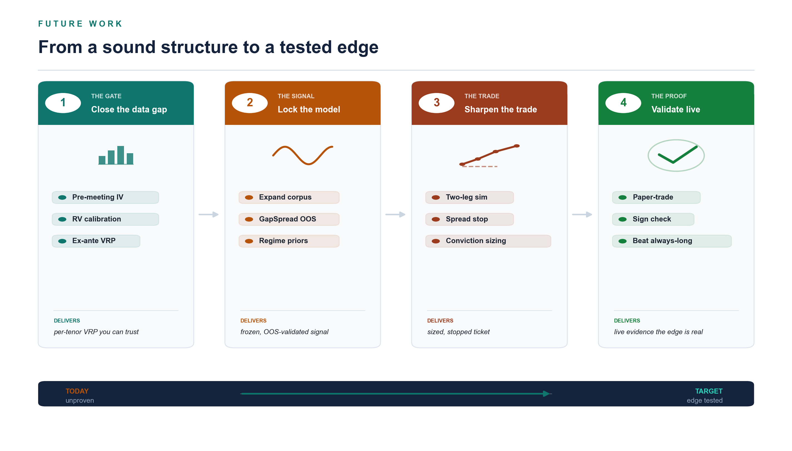

# Forecasting the FOMC Variance Risk Premium from Central-Bank Communication
## Technical Supplement — Machine-Learning Methods, Estimators, and Algorithms

*Companion handout to the trade pitch. Audience: quantitative researchers. This document specifies the formal problem, the data structures, the estimators, the model architecture, the estimation algorithm, and the validation methodology in full. Parameter values are research-stage and pending live calibration. Not investment advice.*

---

## Notation

| Symbol | Meaning |
|---|---|
| m | an FOMC meeting (or dated communication event), m = 1 … M |
| τ | a curve tenor ∈ {2Y, 5Y, 7Y, 10Y, 20Y, 30Y} |
| σ²_RV,event(m,τ) | realized event variance at tenor τ around meeting m |
| σ²_IV,event(m,τ) | option-implied event variance, isolated to the meeting |
| Gap(m,τ) | per-tenor variance risk premium, RV − IV (signed) |
| GapSpread(m) | Gap(m,2Y) − Gap(m,30Y) — the forecast target |
| xₘ ∈ ℝᵖ | text-feature vector for meeting m (post-PCA) |
| rₘ ∈ ℝᵈ | dual-mandate regime vector for meeting m |
| wₘ | regime-similarity sample weight for meeting m |
| ŷₘ | forecast of GapSpread(m); z = ŷ/σ̂ the standardized signal |
| σ_N | normal (basis-point) volatility — the Bachelier parameter |

---

## 1. Problem formulation

We forecast a **signed, curve-relative variance risk premium** from features extracted from Federal Reserve communication, conditioned on the macroeconomic regime.

For meeting m and tenor τ, the per-tenor variance risk premium is

```
Gap(m,τ) = σ²_RV,event(m,τ) − σ²_IV,event(m,τ)          (1)
```

a **signed** quantity in variance space: Gap > 0 ⇔ realized exceeded implied ⇔ the meeting was underpriced ⇔ long-vol signal. The forecast target is the **curve spread**

```
GapSpread(m) = Gap(m,2Y) − Gap(m,30Y)                   (2)
```

We learn a function f: (xₘ, rₘ) ↦ ŷₘ ≈ GapSpread(m), where xₘ are NLP features and rₘ is the regime state. The trade direction is sign(ŷₘ) (positive ⇒ long front-vol / short long-end-vol steepener); the size scales with z = ŷ/σ̂.

**Why a spread, not a level.** Vol *levels* are near-unforecastable from text (we observe out-of-sample R² < 0 on level targets — §10), and a per-tenor *level* model is exactly what produced the mis-located v1 signal. Spreads are forecastable and encode the object of interest: *where on the curve* the premium is mislocated. We never take |GapSpread| — the sign carries the trade direction; collapsing to a magnitude would render the direction undefined.

**Statistical, not riskless.** The target is a *risk premium*. The claim is that f forecasts the spread better than the market prices it at regime transitions — not that the trade is arbitrage.

---



*Figure 1. The two-model split. The GAP model trains only on meetings with usable implied vol (hard-gated) and predicts GapSpread; the FEATURE/SIMILARITY model trains on the full text corpus (including text-only history) to calibrate the NLP factors and the regime-similarity kernel, and never contributes a gap observation.*

---

## 2. Data architecture and structures

### 2.1 Sources (public only — no Bloomberg dependency)

- **Text corpus.** FOMC statements, post-meeting press-conference Q&A transcripts, and Jackson Hole symposium speeches (federalreserve.gov, KC Fed). Each document carries a `doc_type ∈ {statement, presser, speech}` tag.
- **Macro / yields.** FRED REST API: DGS2…DGS30 (yields, curve-shape features), UNRATE (unemployment), PCEPILFE (core PCE level → YoY inflation).
- **Volatility.** Treasury-ETF options as a per-tenor proxy: realized from ETF OHLC via range estimators; implied from the ETF option chain. SHY≈front/2Y, IEF≈10Y, TLT≈long/30Y. Both legs of each Gap are computed from the **same** ETF underlying to guarantee unit consistency. Pre-2020, TYVIX (discontinued 2020) is used as a 10Y cross-check only.

### 2.2 The implied-vol data wall and the two-model consequence

Text exists for all eras; matched **implied** does not (option depth thins going back, and event-isolating weeklies/smile have shorter history than the ATM grid). The gap target (1) can therefore only be constructed where both sides exist. This asymmetry is not a nuisance — it *defines the architecture*: a **GAP model** trained only where implied exists, and a separate **FEATURE/SIMILARITY model** trained on the full text corpus that calibrates features and the similarity kernel but never emits a gap observation (Figure 1, §8).

### 2.3 Core data structures

The pipeline is keyed on a canonical meeting table indexed by `meeting_date`, joined to:

```
MeetingRecord {
  meeting_date : date            # primary key
  doc_type     : enum            # statement | presser | speech
  text_raw     : str
  x_features   : float[p]        # post-NER, post-PCA NLP factors
  regime_vec   : float[d]        # dual-mandate state (continuous)
  regime_label : enum            # overheating | at_target | slack | easing
  gap[τ]       : float           # signed VRP per tenor, where IV exists
  gap_spread   : float           # Gap(2Y) − Gap(30Y), where both exist
  iv_present[τ]: bool            # gate flag — drives w_m hard gate
  quality      : enum            # gap_grade | level_only | imputed
}
```

Hierarchical key convention for cached artifacts: `table:meeting_date:tenor`. Join is left-on `meeting_date`; the `iv_present` mask is the gate that zeroes sample weights where the gap is undefined (§8.2).

---

## 3. NLP feature engineering

The features score **information density and novelty** — the properties that widen the outcome distribution — not hawk/dove sentiment (tone predicts direction; we need dispersion).

### 3.1 Filtering

1. **Named-entity removal.** spaCy NER strips `PERSON`/`GPE`/`ORG`/`DATE` spans (speaker names carry no vol information and otherwise dominate token frequency), plus stopwords and FOMC boilerplate.
2. **Register normalization.** Press-conference and speech text is a different register (long, conversational, contains journalist questions). We retain only the Chair's spoken answers and **length-normalize to densities per 1,000 tokens**, so a 6,000-word Q&A is comparable to a 130-word statement.
3. **doc_type tagging** is preserved as a control covariate (and an ablation axis — §10).

### 3.2 Scoring the five vol categories

| Category | Construct | Effect on vol |
|---|---|---|
| Ambiguity | vague qualifiers admitting multiple readings | widens |
| Uncertainty | explicit hedging / modality about the path | widens |
| Conditionality | state-contingent "if / should … we would" | widens |
| Dissent | committee divergence, range of views | widens |
| Guidance specificity | concrete forward commitment / path language | **suppresses** |

Two scorers, used in agreement: a **deterministic Loughran–McDonald** dictionary baseline (offline, reproducible) and an **LLM scorer constrained to linguistic properties only** — never "was this consequential," which would inject hindsight. LLM calls are temperature-0 and cached by `hash(text)` so the backtest is bit-reproducible.

### 3.3 Dimensionality reduction

The five category densities are correlated; on a sample of M ≈ 130 we cannot afford five collinear regressors. We reduce to one (occasionally two) factors by PCA, **fit on the training fold only** (the loadings are re-estimated each walk-forward step to avoid look-ahead). The resulting xₘ ∈ ℝᵖ, p ∈ {1,2}, is the text feature.

---

## 4. Dual-mandate regime labeling

Regime is labeled by the **economic state that drives the reaction function**, not by chair identity (a single chair spans hawkish and dovish regimes — chair is a proxy that fails exactly when it matters).

From FRED, per meeting date:

```
inflation_gap     = corePCE_YoY − 2.0
unemployment_gap  = UNRATE − natural_rate            # natural_rate = slow UNRATE trend / NROU
direction         = sign(Δ policy_rate, trailing)    # tightening vs easing
rₘ = (inflation_gap, unemployment_gap, direction, |distance-to-target|)
```

We expose both the **continuous** vector rₘ (for the kernel and interactions) and a **discrete** label by thresholding (overheating / at-target / slack / easing) for stratified reporting. Both are economically primitive — defined independently of any vol outcome — which is what licenses using them as conditioning variables without circularity.

A separate **communication-architecture layer** (a dated chronology tagged by information direction: *adding* structure ⇒ vol-suppressing; *removing* structure ⇒ vol-widening, front-loading) defines the `RegimeTransition` indicator and sets the **sign** of the mechanism prior (§8.3). It is used for definition and prior-setting only — never regressed on (the changes are too few and confounded with the crises that caused them).

---

## 5. The variance-risk-premium target

### 5.1 Realized event variance (range estimators)

Without tick data, realized variance is recovered from the daily OHLC bar, capturing the intraday swing a close-to-close return discards:

```
Parkinson:     σ²_P  = (ln(H/L))² / (4 ln 2)

Garman–Klass:  σ²_GK = ½ (ln(H/L))² − (2 ln2 − 1)(ln(C/O))²
```

Both assume a continuous diffusion and therefore **understate genuine jumps** — so the event-day realized measure is conservative, biasing the test *against* finding underpricing (a credibility asset). The event window is annualized consistently: σ_event = √(252 · daily_var) · 100 (percent vol).

### 5.2 Implied event variance (event isolation via the kink)

The meeting's implied variance is isolated by differencing a meeting-spanning expiry against a non-spanning one:

```
σ²_IV,event = σ²_span · T_span − σ²_pre · T_pre          (3)
```

This removes the diffusive component and leaves the event premium. **Critical calibration constraint:** IV and RV must share the same horizon and annualization before differencing into (1). A 30-day implied differenced against a 1-day realized produces a constant wedge that is an artifact, not a premium — the arbiter is a **no-edge break-even test** on a clean single-source regime (2017–2018): price the straddle off IV, simulate P&L off RV, and require mean ≈ −costs.

### 5.3 Unit guard

Tenors with a liquid future (2Y/5Y/10Y/30Y) yield a price-vol estimator (pp); cash-only tenors (7Y/20Y) yield a yield-change estimator (bp). The GapSpread legs (2Y, 30Y) must be the **same** estimator/units — asserted in code. A spread mixing pp and bp is rejected.

---

## 6. The forecasting model

### 6.1 Specification

The GAP model is a regime-interacted linear model with informative-prior shrinkage:

```
GapSpread(m) = α + β·xₘ + γ·(xₘ ⊙ RegimeTransitionₘ) + δᵀ·controlsₘ + εₘ     (4)
```

where controls = (implied-vol percentile [VRP mean-reversion], lagged realized spread, high-frequency policy surprise [Kuttner / GSS / Nakamura–Steinsson / Bauer–Swanson], doc_type, regime label). The γ term — text interacted with the guidance-withdrawal regime — is the Warsh mechanism and the one principled divergence from the market's anchor.

### 6.2 Mechanism-prior shrinkage (Bayesian ridge)

With n ≈ 1–2 for the regime of interest, γ cannot be estimated from data alone without overfitting. We place an **informative Gaussian prior** on γ whose mean encodes the mechanism's sign (guidance withdrawal ⇒ positive front-end gap ⇒ γ_prior > 0):

```
γ ~ 𝒩(γ₀, τ²_γ),     β,δ ~ 𝒩(0, τ²_β)
posterior:  argmin_θ  Σₘ wₘ (yₘ − fθ(xₘ,rₘ))² + λ_β‖β,δ‖² + λ_γ‖γ − γ₀‖²     (5)
```

so one Warsh-like observation *updates* the prior rather than defining it. λ_γ = σ²/τ²_γ is the prior strength (a config knob); we report the posterior mean and CI of γ and flag if data-alone would overfit it. This is a weighted ridge with a non-zero shrinkage target on the interaction block.

### 6.3 Regime-similarity sample weighting (data-gated kernel)

Each historical meeting is weighted by similarity to the forecast regime via a Gaussian kernel on the observable regime vector, **subject to a hard gate**:

```
wₘ = iv_present(m) · exp( − ‖rₘ − r_now‖²_Σ / h )          (6)
```

where iv_present(m) ∈ {0,1} zeroes any meeting lacking usable implied (no implied ⇒ no gap target, regardless of similarity), ‖·‖_Σ is a Mahalanobis distance (Σ = regime-covariance), and h is the bandwidth. Effect: 2017–2018 (clean implied, hiking regime) weights heavily; ZLB years weight lightly; text-only history (Greenspan) weights **zero** in the gap model. We report the effective sample size n_eff = (Σ wₘ)² / Σ wₘ² so the thinness is explicit.

### 6.4 The two-model split

- **GAP model** — (4)–(6), trained on gap-grade meetings; predicts GapSpread.
- **FEATURE / SIMILARITY model** — trained on the full text corpus including pre-2010 and Greenspan-era text; calibrates the NLP factors (PCA loadings) and the kernel (6). It contributes **no** gap observation. A quantitative Greenspan-vs-Warsh similarity test decides whether Greenspan-era features legitimately inform the kernel.

---

## 7. Estimation algorithm (walk-forward, no look-ahead)

Every transform that learns parameters (PCA loadings, scalers, regime thresholds, ridge λ, kernel h) is fit on the training fold only. The walk-forward is expanding-window.

```
ALGORITHM 1 — Walk-forward GapSpread estimation
Input:  meetings sorted by date; feature/regime/gap tables; hyperparams (λ_β, λ_γ, γ₀, h)
Output: OOS forecasts ŷ; OOS metrics with CIs

for t in test_indices (expanding):
    train ← meetings[: t]                       # strictly past
    test  ← meetings[t]                          # one-step-ahead
    # 1. fit feature/label transforms on TRAIN only
    PCA, scaler ← fit_text_factors(train.text)
    regime_thr  ← fit_regime_thresholds(train.macro)
    Σ, h        ← fit_kernel(train.regime_vec)
    # 2. compute sample weights with hard gate (eq.6)
    w ← iv_present(train) ⊙ gaussian_kernel(train.regime_vec, test.regime_vec; Σ, h)
    # 3. solve weighted ridge with mechanism prior (eq.5)
    θ ← argmin  Σ_m w_m (y_m − f_θ(x_m, r_m))² + λ_β‖β,δ‖² + λ_γ‖γ − γ₀‖²
    # 4. predict one-step-ahead
    ŷ[t] ← f_θ(transform(test))
    record (ŷ[t], y[t], regime_label[t], doc_type[t])

# 5. metrics: RMSE, R², sign-hit-rate (Wilson CI), vs-benchmark P&L
# 6. bootstrap the trade sequence → CIs;  leave-one-regime/chair-out
```

**Complexity.** Per fold the dominant cost is the weighted ridge solve, O(p³ + p²·n_train) for p ≪ n (here p ∈ {1..~8} after PCA, n ≤ M), i.e. effectively O(M) per fold and O(M²) for the full expanding walk-forward — trivial at M ≈ 130. The kernel weights are O(n·d). The binding constraint is statistical (n_eff), not computational.

**Numerical notes.** Vol forecasts are floored at 0 (a negative implied/realized vol is a pipeline bug — we observed one −33% extrapolation from a sparse-fold regime dummy and clamp it). Single-row test folds with zero feature variance are detected and excluded (they otherwise collapse to predicting the train mean with spurious ΔRMSE = 0).

---

## 8. Validation methodology

The validation posture matches the data reality (small, regime-imbalanced sample):

- **Out-of-sample only.** Walk-forward, expanding; no statistic is reported in-sample. The headline comparison is **NLP-only vs NLP×regime, OOS, on Powell's multi-regime tenure** (the within-sample regime variation that lets us *test* conditioning).
- **Metrics.** OOS RMSE and R² (de-emphasized — levels are unforecastable), **sign hit rate with Wilson interval** (the trade-relevant metric), and P&L of trading the signal vs naive benchmarks (always-long-vol, never-trade, random, implied-percentile-only). The signal must beat the naive benchmark on the regime-similar subsample.
- **Stability.** Bootstrap CIs on the trade sequence; leave-one-regime-out and leave-one-chair-out; doc_type ablation (statements-only vs +pressers vs +Jackson Hole); presser-availability robustness (pre-2019 meetings often lack pressers — the model must handle "presser absent" as a legitimate state and not exploit only the post-2019 era).
- **Acceptance tests (falsifiable).** (i) **Warsh sign flip** — the retrained Warsh signal must flip from sell-vol to buy-front-end-vol; if it does not, report it, do not tune. (ii) **No-edge break-even** — at z = 0 the simulated P&L must equal −costs. (iii) **Consistency guard** — Warsh is scored on the **same** document types (statement + presser) as training, or the n = 1 forward test is invalid.

---

## 9. From forecast to trade

### 9.1 Pricing (Bachelier normal vol)

Rates options are priced in normal (bp) vol — yields can approach zero and normal vol is more stable across strikes. For an option on forward F, strike K, expiry T, with d = (F − K)/(σ_N√T):

```
Straddle_N = 2 · σ_N √T · φ(d) + (F−K)[2Φ(d) − 1]
vega = √T · φ(d)         (ATM: d→0, vega = √T·φ(0), independent of σ_N and level)
```

The ATM-vega identity is why **yield-vega-neutral** sizing scales with DV01, not notional (§9.2).

### 9.2 Sizing (vega-neutral solve)

Anchor the 30Y leg at the desk minimum ($50M); solve the 2Y notional for yield-vega-neutrality:

```
N_2Y · vega_yield($/bp; 2Y) = N_30Y · vega_yield($/bp; 30Y)
⇒ N_2Y / N_30Y ≈ DV01_30Y / DV01_2Y ≈ 10–12×           (price-vega ≈ equal at ATM)
```

The ~10× larger 2Y notional is vega-equivalent, not oversized. The book is then long the 2s30s vol spread, **neutral to the level of vol** (net vega ≈ 0), with residual short-gamma risk concentrated in the short 30Y leg.

### 9.3 Coherence requirement (signal ↔ simulation)

The Monte Carlo must draw the FOMC jump and the position size from the **same** GapSpread forecast:

```
σ_fomc,realized = (1 + κ·z) · σ_IV,event,     size ∝ max(0, z)
```

so a buy-vol forecast widens the simulated jump *and* sizes the long leg up — they cannot contradict. The premium is priced off **market implied** (Group A inputs); the jump is drawn off the **model forecast** (Group B). The gap between them is the edge — they are never sourced from the same number.

---

## 10. Empirical status (honest)

**The current OOS result is a FLAG.** On 51 Powell meetings, NLP×regime did **not** reliably beat NLP-only out-of-sample:

| Metric | NLP-only | NLP×regime | Δ |
|---|---|---|---|
| OOS RMSE | 1.3206 | 1.3552 | +0.035 (worse) |
| OOS R² | −0.046 | −0.101 | −0.056 |
| Sign hit rate | 74.5% | 70.6% | −3.9 pp |

The per-regime decomposition is diagnostic: conditioning **helps in slack (+12.5% SHR)** but **hurts in overheating (−13.5%)**, the dominant regime — the signature of interaction terms fitting in-sample noise where the data is densest. The governing principle (no added DoF without OOS signal) fired as intended. **We report the FLAG; we do not tune until regime wins.** Note the text alone has a 74.5% OOS sign hit rate — real signal — even though regime conditioning does not currently add to it on this sample.

Principled, pre-registered respecifications under test (reported win-or-lose): parsimony (single PCA factor × binary/continuous regime, one interaction not twenty); regime by *change*/distance not level; target = sign/GapSpread not RMSE on unforecastable levels; regime-balanced evaluation. The model is **locked on Powell before** the single Warsh forward test is run.

**Separable conclusion:** the trade *structure* is sound (clean convexity, event isolation, vega-neutral, bounded long-leg risk); the *signal* is unproven as a filter (it has not beaten always-long-vol OOS after costs). The honest ask is a paper-traded test, not capital.

---

## 11. Roadmap

The open work is dependency-ordered: the data gate (per-tenor implied + IV/RV calibration) gates the model (signed GapSpread, regime conditioning locked on Powell), which gates the trade (two-leg calibration, instrument choice, stop + conviction sizing), which gates live validation (paper-trade two meetings, confirm the sign flip, beat always-long after costs).



*Figure 2. From a sound structure to a tested edge — the data gate first, because every downstream step depends on it.*

---

## References

Barberis, Shleifer, Vishny (1998), *A model of investor sentiment*, JFE.
Bauer, Swanson (2023), *A reassessment of monetary policy surprises and high-frequency identification*, NBER Macro Annual.
Bollerslev, Tauchen, Zhou (2009), *Expected stock returns and variance risk premia*, RFS.
Carr, Wu (2009), *Variance risk premiums*, RFS.
Choi, Mueller, Vedolin (2017), *Bond variance risk premia*, Review of Finance.
Cieslak, Schrimpf (2019), *Non-monetary news in central bank communication*, JIE.
Coibion, Gorodnichenko (2015), *Information rigidity and the expectations formation process*, AER.
Garman, Klass (1980), *On the estimation of security price volatilities from historical data*, J. Business.
Gürkaynak, Sack, Swanson (2005), *Do actions speak louder than words?*, IJCB.
Hansen, McMahon (2016), *Shocking language: understanding the macroeconomic effects of central bank communication*, JIE.
Husted, Rogers, Sun (2020), *Monetary policy uncertainty*, JME.
Jarociński, Karadi (2020), *Deconstructing monetary policy surprises*, AEJ: Macro.
Kuttner (2001), *Monetary policy surprises and interest rates*, JME.
Loughran, McDonald (2011), *When is a liability not a liability? Textual analysis, dictionaries, and 10-Ks*, J. Finance.
Lucca, Trebbi (2009), *Measuring central bank communication*, NBER WP.
Nakamura, Steinsson (2018), *High-frequency identification of monetary non-neutrality*, QJE.
Parkinson (1980), *The extreme value method for estimating the variance of the rate of return*, J. Business.
Shapiro, Wilson (2022), *Taking the Fed at its word: direct estimation of central bank objectives*, RES.

---

## Appendix A — Reproducibility and data lineage

- All learned transforms fit on training folds only; LLM scores cached by content hash; FRED key in env var.
- Every visualization carries a provenance stamp (source variable, row count, `doc_type` breakdown, date range); a guard assert fails loudly if the corpus is stale (only `statement` rows present).
- The gap is constructed only from gap-grade implied (Bloomberg-equivalent or ETF-option-reconstructed); MOVE/level bridges feed the percentile control and similarity kernel only, never the per-tenor gap.

## Appendix B — Hyperparameters (research-stage)

| Param | Symbol | Default | Role |
|---|---|---|---|
| Text factors | p | 1–2 | PCA components on the 5 categories |
| Kernel bandwidth | h | tuned OOS | regime-similarity decay |
| Ridge (main) | λ_β | tuned OOS | shrinkage on β, δ |
| Ridge (interaction) | λ_γ | prior-strength | shrinkage of γ toward γ₀ |
| Prior mean | γ₀ | +sign | mechanism: guidance withdrawal ⇒ front gap |
| Conviction scale | κ | swept | size ∝ max(0, z); links sim jump to forecast |

*End of technical supplement. All parameter values are research-stage and pending live calibration.*
